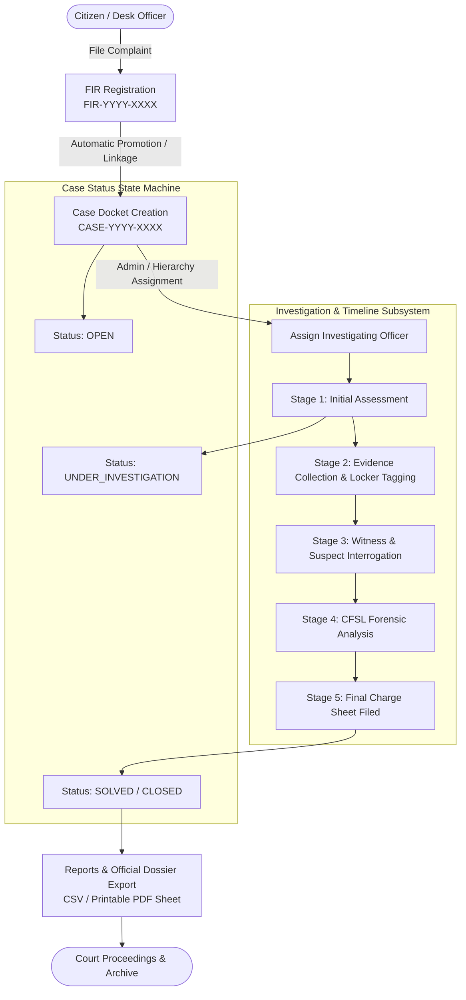

# 🛡️ CrimeTrack — Police Crime & Case Management System
### *Enterprise Law Enforcement Case Docket, Investigation Timeline & Forensic Auditing Platform*

[](https://nodejs.org/)
[](https://expressjs.com/)
[](https://www.mongodb.com/)
[](https://react.dev/)
[](https://vitejs.dev/)
[](https://tailwindcss.com/)
[](http://localhost:5000/api/health)

---

## 📖 Table of Contents
1. [Executive Summary & Purpose](#-executive-summary--purpose)
2. [Problems Solved & Core Innovations](#-problems-solved--core-innovations)
3. [End-to-End Operational Workflow](#-end-to-end-operational-workflow)
4. [Role-Based Access Control (RBAC) & Privacy Matrix](#-role-based-access-control-rbac--privacy-matrix)
5. [Complete Subsystems & Feature Breakdown](#-complete-subsystems--feature-breakdown)
6. [System Architecture & Design System](#-system-architecture--design-system)
7. [Database Schema & Data Models](#-database-schema--data-models)
8. [REST API Surface Summary](#-rest-api-surface-summary)
9. [Quick-Start Installation Guide (Run on Any Laptop)](#-quick-start-installation-guide-run-on-any-laptop)
10. [Demo Login Credentials & Scenarios](#-demo-login-credentials--scenarios)
11. [Automated QA Test Suite & Diagnostics](#-automated-qa-test-suite--diagnostics)
12. [Repository Directory Structure](#-repository-directory-structure)

---

## 🎯 Executive Summary & Purpose

**CrimeTrack** is a full-stack, institutional-grade Police Crime & Case Management web application engineered for law enforcement precincts, district headquarters, and supervisory command centers.

In traditional law enforcement workflows, police records often suffer from:
* Fragmented physical paper dockets and lost evidence chains.
* Accidental privacy leaks when looking up repeat offenders across different investigation units.
* Unsupervised case status modifications and lack of tamper-evident accountability.
* Inability to roll back accidental record deletions or erroneous status mutations.
* Delayed response times due to disconnected complaint registries and investigation diaries.

**CrimeTrack resolves these challenges** by delivering a unified, role-governed digital command center built on the **MERN Stack (MongoDB, Express.js, React, Node.js)** with Tailwind CSS, supporting the entire lifecycle from citizen FIR registration to court-ready charge-sheet filings.

---

## 💡 Problems Solved & Core Innovations

| Operational Challenge | How CrimeTrack Solves It | Technical Implementation |
| :--- | :--- | :--- |
| **Sequential Record Numbering** | Eliminates manual register entry errors and duplicate case IDs. | Auto-generates format `FIR-YYYY-XXXX` and `CASE-YYYY-XXXX` using atomic sequential regex query aggregations. |
| **Criminal Record Privacy Leaks** | Officers need to know if a suspect exists without seeing private files of other active cases. | **Privacy-Preserving Criminal Search Engine**: Exposes only basic identifier tokens (`name`, `aliases`, `identifyingMarks`), redacting all case notes, evidence, and other officers' private investigations. |
| **Evidence Misplacement** | Loss of custody logs for weapons, digital files, and forensic lab reports. | Dedicated **Multi-Format Evidence Lockers** (`DOCUMENT`, `IMAGE`, `PHYSICAL`, `DIGITAL`, `WEAPON`) timestamped with collector identity and storage vault numbers. |
| **Tamper-Evident Accountability** | Inability to identify who modified case priorities, statuses, or notes. | **Immutable Forensic Audit Ledger**: Every mutation logs actor ID, IP address, timestamp, action type, and deep `oldValues` vs `newValues` snapshots. |
| **Accidental Deletions / Corruptions** | Accidental removal of critical incident records. | **State-Aware Rollback & Recovery Subsystem**: One-click recovery that re-applies stored field snapshots, recovers soft-deleted entities, and records unbroken `UNDO_MUTATION` audit trails. |
| **Citizen & Officer Voice** | Disconnected grievance and feedback mechanisms. | **Integrated Feedback Hub**: 5-star rating matrix, priority escalation, bug reporting, and official Admin resolution workflows. |

---

## 🔄 End-to-End Operational Workflow

The system coordinates criminal justice proceedings through a structured, multi-stage state machine:



1. **Incident Intake**: Complainant details, incident date/place, and crime categories are filed into an official **FIR**.
2. **Case Promotion**: A unique **Case Docket** is automatically generated and assigned to a specialized Investigating Officer.
3. **Investigation Journaling**: The assigned officer logs chronological field observations and attaches tagged evidence items.
4. **Repeat Offender Linkage**: The officer searches the **Criminal Registry** using privacy-safe minimal search and links identified suspects.
5. **Resolution & Archival**: Case status transitions from `OPEN` to `UNDER_INVESTIGATION` and ultimately `SOLVED` or `CLOSED`. Official printable sheets and CSV datasets are generated for judicial dispatch.

---

## 🔒 Role-Based Access Control (RBAC) & Privacy Matrix

CrimeTrack enforces strict, non-bypassable backend middleware authorization (`authenticate` and `authorize`):

| Capability / Entity | Station Administrator (`ADMIN`) | Investigating Officer (`OFFICER`) | Desk Clerk / Viewer (`VIEWER`) |
| :--- | :---: | :---: | :---: |
| **System Overview & Health** | Full Access | Full Access | Full Access |
| **User Account Provisioning** | Full CRUD | ❌ 403 Forbidden | ❌ 403 Forbidden |
| **FIR Management** | Global Station-Wide | Self-Assigned Records Only | Supervised Read-Only (Officer Scoped) |
| **Case Registry** | Global Station-Wide | Self-Assigned Records Only | Supervised Read-Only (Officer Scoped) |
| **Criminal Registry Master** | Full CRUD | View & Link to Cases | Read-Only Profile View |
| **Criminal Search Privacy** | Full Profile View | Minimal Redacted Search | Minimal Redacted Search |
| **Investigation Diaries & Evidence** | Global Review | Create & Edit Own Diaries | Supervised Read-Only |
| **Security Audit Logs** | Full View & Diff Inspector | ❌ 403 Forbidden | ❌ 403 Forbidden |
| **Disaster Recovery / Undo Rollbacks** | Full Rollback Triggers | ❌ 403 Forbidden | ❌ 403 Forbidden |
| **Reports & CSV Data Streaming** | Station-Wide Exports | Assigned Scope Exports | Assigned Scope Exports |
| **Feedback Hub & Triage** | Full Triage & Official Response | Submit & Track Own Feedback | Submit & Track Own Feedback |
| **System QA Test Runner** | Full Diagnostic Runner | ❌ 403 Forbidden | ❌ 403 Forbidden |

---

## 🏛️ Complete Subsystems & Feature Breakdown

### 1. Command Overview & Health Telemetry (`/`)
* Live connection handshakes for Express API gateway and MongoDB replica cluster.
* Real-time server uptime, database response latency, and security protocol monitors.
* Quick access registry tiles for rapid one-click navigation across precinct tools.

### 2. Personnel & User Directory (`/users`)
* Admin console for provisioning **Officers** and **Viewers**.
* Supervisory linking: assigns desk viewers to specific senior officers for data governance.
* Employee ID tracking, departmental allocation, phone records, and instant active/inactive account toggling.

### 3. FIR Management (`/firs`)
* Automated sequential numbering: `FIR-YYYY-XXXX` (e.g. `FIR-2026-0001`).
* Category classification (`THEFT`, `ROBBERY`, `CYBERCRIME`, `HOMICIDE`, `BURGLARY`, `EXTORTION`, `ASSAULT`, `FRAUD`, etc.).
* Complainant identity management, incident geolocation, and date-time indexing.
* **Official Printable Police Sheet**: Generates formatted, printer-ready FIR summary sheets.

### 4. Case Docket Registry (`/cases`)
* Automated sequential docket numbering: `CASE-YYYY-XXXX`.
* Priority matrix tags: `LOW`, `MEDIUM`, `HIGH`, `CRITICAL`.
* Lifecycle state progression: `OPEN` $\rightarrow$ `UNDER_INVESTIGATION` $\rightarrow$ `SOLVED` $\rightarrow$ `CLOSED`.
* Case history audit trail tracking timestamps and reassigned investigating officers.

### 5. Privacy-Preserving Criminal Master Directory (`/criminals`)
* Global, reusable identity registry across multiple cases.
* Records physical identification marks, blood groups, known aliases, and age.
* **Strict Privacy Redaction**: Global search returns only identity verification data, redacting all other officers' private case dockets and notes.

### 6. Investigation Diaries & Evidence Lockers (`/investigations`)
* Chronological case journal with 5-stage progression meter:
  1. `INITIAL_EVALUATION`
  2. `EVIDENCE_COLLECTION`
  3. `INTERROGATION`
  4. `FORENSIC_ANALYSIS`
  5. `FINAL_REPORT`
* **Evidence Vaults**: Categorized evidence tagging (`WEAPON`, `DIGITAL`, `DOCUMENT`, `PHYSICAL`, `IMAGE`).

### 7. Dashboard Analytics & Visual Chart Suite
* Real-time aggregated KPI counters (Total Cases, Active FIRs, Solved Cases, Clearance Rate %).
* Crime distribution breakdowns, status progression funnels, and monthly incident volume trends.

### 8. Cross-Entity Global Omni-Search (`/search`)
* High-velocity query engine searching simultaneously across FIRs, Cases, Crimes, Criminals, and Investigations.
* Multi-criteria filter drawer supporting date ranges, crime categories, priority levels, and stage filters.

### 9. Reports & CSV Data Streaming (`/reports`)
* Filtered data exports with dynamic column formatting for official department compliance.
* Instant CSV streaming (`text/csv`) and raw JSON payloads.
* Printable official crime summary dossiers.

### 10. Immutable Security Audit Logs (`/logs`)
* Comprehensive forensic ledger recording every create, update, delete, and login event.
* **Side-by-Side Audit Diff Inspector**: Visual modal comparing `oldValues` vs `newValues` before and after mutations.
* Filterable by action type, entity, officer, and date range.

### 11. Undo & Disaster Recovery Subsystem (`/recovery`)
* Non-destructive state rollback engine.
* Restores prior field snapshots directly from stored audit metadata.
* Recovers soft-deleted records (`isDeleted: false`) and maintains unbroken `UNDO_MUTATION` audit trails.

### 12. Citizen & Officer Feedback Hub (`/feedback`)
* Categorized feedback tickets: `BUG_REPORT`, `FEATURE_REQUEST`, `CASE_FEEDBACK`, `SYSTEM_FEEDBACK`.
* Interactive 5-star rating matrix with optional linked case tagging.
* Admin triage console with priority adjustment, status management, and official response publication.

### 13. System Diagnostics & Automated QA Suite (`/qa`)
* In-app automated test harness executing **34 end-to-end assertions** across all 13 subsystems.
* Live latency reporting, pass/fail telemetry, and zero-regression verification.

---

## 🎨 System Architecture & Design System

### Technology Stack
* **Frontend Client**: React 18, Vite 5, Tailwind CSS, Lucide React, Axios (with request/response interceptors).
* **Backend API Gateway**: Node.js, Express.js, Mongoose ODM, JWT, bcryptjs, CORS.
* **Database**: MongoDB (indexes on sequential identifiers, role scoping, and text fields).

### Institutional Palette & Tokens
CrimeTrack utilizes an authoritative institutional palette tailored for law enforcement operations:
* **Command Dark Navy**: `#0F172A` (Sidebar & Header structures)
* **Police Slate**: `#1E293B` (Panels & Sub-navigation)
* **Institutional Brand Blue**: `#2563EB` (Primary buttons, accents, active states)
* **Surface Background**: `#F8FAFC` (Clean operational layout)
* **Cards & Containers**: `#FFFFFF` with subtle border `#E2E8F0`
* **Semantic Status Colors**:
  * Success / Solved: `#059669` (Emerald)
  * Warning / In-Review: `#D97706` (Amber)
  * Danger / Critical: `#DC2626` (Red)
  * Informational / Open: `#2563EB` (Brand Blue)

---

## 🗄️ Database Schema & Data Models

```
┌──────────────┐       1:1       ┌──────────────┐       1:N       ┌──────────────────┐
│     User     │◄───────────────►│     FIR      │◄───────────────►│       Case       │
│ (Personnel)  │                 │ (Complaint)  │                 │  (Investigation) │
└──────┬───────┘                 └──────────────┘                 └────────┬─────────┘
       │                                                                   │
       │ 1:N (Assigned)                                            1:N     │
       ├───────────────────────────────────────────────────────────────────┤
       │                                                                   ▼
       │ 1:N                     ┌──────────────┐                 ┌──────────────────┐
       ├────────────────────────►│  AuditLog    │                 │   Investigation  │
       │                         │ (Forensics)  │                 │  (Diary & Vault) │
       │                         └──────────────┘                 └────────┬─────────┘
       │ 1:N                                                               │ 1:N (Evidence)
       ├────────────────────────►┌──────────────┐                         ▼
       │                         │   Feedback   │                 ┌──────────────────┐
       │                         │ (Triage Hub) │                 │   EvidenceItem   │
       │                         └──────────────┘                 │ (Tagged Lockers) │
       ▼                                                          └──────────────────┘
┌──────────────┐       N:M (Associated Cases)
│   Criminal   │◄─────────────────────────────────────────────────┐
│ (Directory)  │                                                  │
└──────────────┘                                                  │
       ▲                                                          │
       └──────────────────────────────────────────────────────────┘
```

---

## 🌐 REST API Surface Summary

| Domain / Subsystem | Method | Route | Access Level | Description |
| :--- | :---: | :--- | :---: | :--- |
| **Health** | `GET` | `/api/health` | Public | System status and MongoDB live health |
| **Authentication** | `POST` | `/api/auth/login` | Public | Authenticate user & issue JWT bearer token |
| | `GET` | `/api/auth/me` | Authenticated | Retrieve profile details of logged-in user |
| **User Directory** | `GET` | `/api/users` | Admin Only | List personnel with role and supervisor filters |
| | `POST` | `/api/users` | Admin Only | Provision new Officer or Viewer account |
| | `PATCH`| `/api/users/:id` | Admin Only | Update details or toggle active status |
| **FIR Management** | `GET` | `/api/firs` | Authenticated | Query FIRs (Role-scoped) |
| | `POST` | `/api/firs` | Officer / Admin | Register new FIR (`FIR-YYYY-XXXX`) |
| | `GET` | `/api/firs/:id` | Authenticated | Get detailed FIR data |
| **Case Registry** | `GET` | `/api/cases` | Authenticated | Query cases with status & priority filters |
| | `POST` | `/api/cases` | Officer / Admin | Create new case linked to FIR |
| | `PATCH`| `/api/cases/:id/status`| Officer / Admin | Transition status (`OPEN`, `UNDER_INVESTIGATION`, `SOLVED`, `CLOSED`) |
| **Criminal Directory**| `GET` | `/api/criminals` | Authenticated | List master criminal identities |
| | `GET` | `/api/criminals/search`| Authenticated | **Privacy-safe minimal search lookup** |
| | `POST` | `/api/criminals` | Officer / Admin | Register new criminal record |
| | `POST` | `/api/criminals/:id/link-case` | Officer / Admin | Link criminal identity to case docket |
| **Investigations** | `GET` | `/api/investigations/case/:caseId/timeline` | Authenticated | Fetch chronological diary & evidence |
| | `POST` | `/api/investigations` | Officer / Admin | Record diary entry with tagged evidence |
| **Analytics & Charts**| `GET`| `/api/dashboard/stats` | Authenticated | Real-time KPI aggregation counts |
| | `GET` | `/api/dashboard/charts` | Authenticated | Analytical chart data distributions |
| **Global Search** | `GET` | `/api/search/global` | Authenticated | Cross-entity multi-filter omni-search |
| **Reports & Export** | `GET` | `/api/reports/firs/export` | Authenticated | Stream FIR dataset as CSV |
| | `GET` | `/api/reports/cases/export` | Authenticated | Stream Case dataset as CSV |
| | `GET` | `/api/reports/summary` | Authenticated | Fetch overall clearance KPIs |
| **Audit Logs** | `GET` | `/api/audit-logs` | Admin Only | Query immutable audit ledger |
| | `GET` | `/api/audit-logs/export` | Admin Only | Export compliance audit trail to CSV |
| **Undo Recovery** | `POST`| `/api/recovery/:id/undo`| Admin Only | Roll back mutation using audit diff |
| | `GET` | `/api/recovery/history` | Admin Only | Retrieve historical rollback actions |
| **Feedback Hub** | `POST` | `/api/feedback` | Authenticated | Submit bug report or rating feedback |
| | `GET` | `/api/feedback` | Authenticated | List feedback (Role-scoped) |
| | `PATCH`| `/api/feedback/:id/triage`| Admin Only | Triage priority and publish admin response |
| **Diagnostics** | `POST` | `/api/tests/run` | Admin Only | Run automated E2E QA regression suite |

---

## ⚡ Quick-Start Installation Guide (Run on Any Laptop)

### 1. Prerequisites
Make sure your system has:
* **Node.js**: v18.0.0 or higher ([Download Node.js](https://nodejs.org/))
* **MongoDB Community Server**: Running locally on `127.0.0.1:27017` ([Download MongoDB](https://www.mongodb.com/try/download/community))
* **npm**: v9.0.0 or higher

---

### 2. Backend Installation & Startup (`server/`)

Open a terminal in the project directory:
```bash
cd server
npm install
```

#### Configure Environment Variables
Create or verify `server/.env` (a template is available in `.env.example`):
```env
PORT=5000
NODE_ENV=development
MONGODB_URI=mongodb://127.0.0.1:27017/crimetrack
JWT_SECRET=CrimeTrack_Super_Secret_JWT_Key_2026_Institutional_Police_Suite_987654321
JWT_EXPIRES_IN=7d
CLIENT_URL=http://localhost:5173
```

#### Seed Comprehensive Demo Police Data
Run the built-in moderate data seeder to immediately populate realistic FIRs, cases, criminals, and investigation entries:
```bash
npm run seed
```

#### Start Backend Server
```bash
npm start
```
> The API will be active on **`http://localhost:5000`** (Health check: `http://localhost:5000/api/health`).

---

### 3. Frontend Installation & Startup (`client/`)

Open a second terminal:
```bash
cd client
npm install
npm run dev
```
> The web application will launch at **`http://localhost:5173`**.

---

## 🔑 Demo Login Credentials & Scenarios

Log in at [`http://localhost:5173/login`](http://localhost:5173/login) using any of these seeded personnel accounts:

| Role | Officer / Personnel Name | Email Address | Password | Assigned Unit & Scope |
| :--- | :--- | :--- | :--- | :--- |
| **`ADMIN`** | Chief Commissioner Alok Deshmukh | `admin@crimetrack.gov` | `Admin@123` | **Full Headquarters Access**: User provisioning, global audit logs, disaster recovery rollbacks, feedback triage, and QA test console. |
| **`OFFICER`** | Senior Inspector Rajesh Sharma | `officer.sharma@crimetrack.gov` | `Officer@123` | **Crime Branch Unit 1**: Assigned to *Zaveri Jewellery Robbery*, *Diamond Necklace Theft*, and *High-Rise Burglary*. |
| **`OFFICER`** | Sub-Inspector Priya Patel | `officer.patel@crimetrack.gov` | `Officer@123` | **Cyber Crime Cell**: Assigned to *Corporate Bank Wire Fraud & Phishing Breach*. |
| **`OFFICER`** | Inspector Amit Verma | `officer.verma@crimetrack.gov` | `Officer@123` | **Anti-Narcotics Division**: Assigned to *Warehouse Homicide* and *Highway Narcotics Distribution*. |
| **`VIEWER`** | Desk Operator Sunita Rao | `viewer.desk@crimetrack.gov` | `Viewer@123` | **Station Helpdesk**: Read-only supervised visibility strictly scoped to Inspector Rajesh Sharma's cases. |
| **`VIEWER`** | Records Clerk Manoj Gupta | `viewer.clerk@crimetrack.gov` | `Viewer@123` | **Central Archives**: Read-only supervised visibility strictly scoped to Sub-Inspector Priya Patel's cases. |

---

## 🧪 Automated QA Test Suite & Diagnostics

CrimeTrack includes an end-to-end automated regression test runner covering all 13 operational domains:

```bash
cd server
npm test
```

### Test Runner Output (34/34 Passing Assertions):
```
====================================================
   CrimeTrack — Quality Assurance Test Suite Run   
====================================================

[✓ PASS] [Foundation] Health check returns 200 OK
[✓ PASS] [Foundation] Database connection status is healthy
[✓ PASS] [Auth] Admin login successful (200 OK)
[✓ PASS] [Auth] JWT token provided for Admin
[✓ PASS] [Auth] Officer login successful (200 OK)
[✓ PASS] [Auth] Invalid credentials return 401 Unauthorized
[✓ PASS] [Users] Admin can list users (200 OK)
[✓ PASS] [Users] User list contains active personnel
[✓ PASS] [Users] Officer blocked from user management (403 Forbidden)
[✓ PASS] [FIR] Admin can list FIRs (200 OK)
[✓ PASS] [FIR] FIRs have valid sequential numbers (FIR-YYYY-XXXX)
[✓ PASS] [Cases] Admin can query case registry (200 OK)
[✓ PASS] [Cases] Case is linked to FIR and Officer
[✓ PASS] [Crimes] Crime list retrieved (200 OK)
[✓ PASS] [Criminals] Minimal privacy criminal search returns 200 OK
[✓ PASS] [Criminals] Privacy: search results do not expose other case details
[✓ PASS] [Investigations] Chronological case timeline returns 200 OK
[✓ PASS] [Investigations] Timeline contains ordered stage progress
[✓ PASS] [Analytics] Admin KPI metrics retrieved (200 OK)
[✓ PASS] [Analytics] KPI statistics include totalFIRs and clearanceRate
[✓ PASS] [Analytics] Analytical chart aggregations retrieved (200 OK)
[✓ PASS] [Global Search] Cross-entity omni-search returns 200 OK
[✓ PASS] [Global Search] Omni-search results grouped by entity
[✓ PASS] [Reports] FIR CSV export returns 200 OK and text/csv
[✓ PASS] [Reports] Case CSV export returns 200 OK
[✓ PASS] [Reports] Report summary KPIs returned (200 OK)
[✓ PASS] [Audit Logs] Admin can query audit trail (200 OK)
[✓ PASS] [Audit Logs] Audit logs contain timestamp and acting user
[✓ PASS] [Audit Logs] Audit CSV compliance export returns 200 OK
[✓ PASS] [Audit Logs] Officer blocked from global audit trail (403 Forbidden)
[✓ PASS] [Recovery] Admin can view rollback history (200 OK)
[✓ PASS] [Recovery] Officer blocked from recovery console (403 Forbidden)
[✓ PASS] [Feedback] Admin can query feedback ledger (200 OK)
[✓ PASS] [Feedback] Feedback statistics calculated (200 OK)

====================================================
   QA SUITE COMPLETE: 34/34 PASSED (100% Success)
====================================================
```

---

## 📂 Repository Directory Structure

```
CrimeTrack/
├── README.md                      # Comprehensive Project Documentation
├── PRD.md                         # Product Requirements Document
├── ARCHITECTURE.md                # System Architecture & Technical Specifications
├── DATABASE_DESIGN.md             # Schema Definitions, Indexes & ERDs
├── API_DESIGN.md                  # REST API Endpoints & Request/Response Contracts
├── DESIGN_SYSTEM.md               # Institutional UI Tokens & Design Rules
├── MILESTONES.md                  # Detailed 15-Milestone Roadmap
│
├── client/                        # Frontend Web Application (React + Vite + Tailwind)
│   ├── src/
│   │   ├── components/            # Reusable UI components
│   │   │   ├── common/            # Navbar, Modals, Loading spinners
│   │   │   ├── dashboard/         # Analytics charts & KPI summary widgets
│   │   │   └── layout/            # Sidebar navigation & Layout wrappers
│   │   ├── context/               # AuthContext (JWT session state)
│   │   ├── pages/                 # Full operational views
│   │   │   ├── admin/             # AdminDashboard, Users, AuditLogs, RecoveryConsole, TestConsole
│   │   │   ├── auth/              # Login portal
│   │   │   ├── cases/             # Cases registry & status lifecycle
│   │   │   ├── criminals/         # Criminal master directory & privacy search
│   │   │   ├── feedback/          # Feedback hub & triage
│   │   │   ├── fir/               # FIR management & printable police sheets
│   │   │   ├── investigations/    # Investigation journals & evidence lockers
│   │   │   ├── officer/           # OfficerWorkspace
│   │   │   ├── reports/           # Reports & CSV export center
│   │   │   ├── search/            # Global omni-search
│   │   │   ├── viewer/            # ViewerPortal
│   │   │   └── FoundationStatus.jsx # Station Command Overview Hub
│   │   ├── routes/                # AppRoutes with ProtectedRoute & RoleRoute guards
│   │   ├── services/              # Axios API service clients
│   │   └── index.css              # Custom Tailwind utilities & institutional color tokens
│   ├── .env.example               # Frontend environment template
│   ├── package.json               # Frontend dependencies & build scripts
│   ├── tailwind.config.js         # Custom police palette theme configuration
│   └── vite.config.js             # Vite dev server & backend API proxy setup
│
└── server/                        # Backend REST API Server (Node.js + Express + MongoDB)
    ├── src/
    │   ├── config/                # MongoDB connection & environment loader
    │   ├── controllers/           # HTTP Request handlers (Auth, FIR, Case, Crime, Criminal, etc.)
    │   ├── middleware/            # Auth, Role-Based Access Control & Error handlers
    │   ├── models/                # Mongoose Models (User, FIR, Case, Crime, Criminal, Investigation, Feedback, AuditLog)
    │   ├── routes/                # Express API Route definitions
    │   ├── services/              # Core business logic & database queries
    │   ├── utils/                 # Moderate data seeder & response formatting helpers
    │   │   ├── seedAdmin.js       # Admin user bootstrapper
    │   │   ├── seedComprehensiveData.js # Comprehensive moderate dataset seeder
    │   │   └── responseHelper.js  # Standardized JSON response envelopes
    │   ├── app.js                 # Express Application & route mounting
    │   └── server.js              # Server entry point & graceful shutdown hooks
    ├── tests/
    │   └── e2eTestSuite.js        # Automated End-to-End QA Integration Runner
    ├── .env.example               # Backend environment template
    └── package.json               # Backend dependencies, start, seed, and test scripts
```

---

## ⚖️ License
This project is licensed under the **ISC License**. Created for institutional police case management and academic research.
